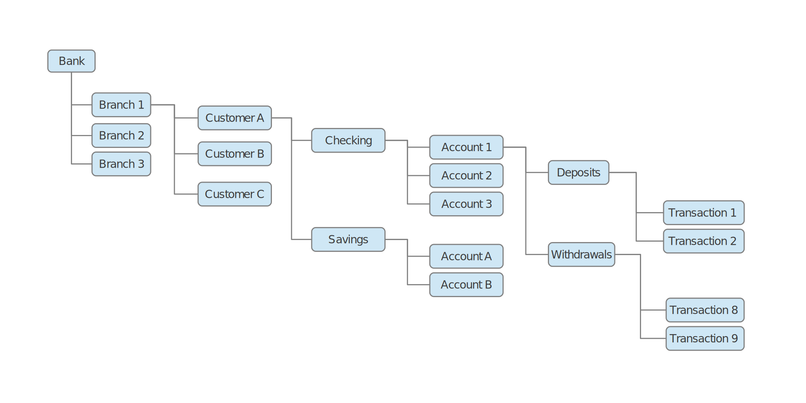

Data Model
==========

Hierarchical
------------

`GT.M`_  uses a `Hierarchical tree data model`_.

The GT.M data model uses a hierarchical associative memory (a multi-dimensional
array) that imposes no restrictions on the data types of the indexes and the
content.

The application logic can impose any schema, dictionary or data organization
suited to its problem domain.

GT.M's compiler for the standard `M scripting language`_ implements full
support for ACID (Atomic, Consistent, Isolated, Durable) transactions, using
optimistic concurrency control and software transactional memory (STM) that
resolves the common mismatch between databases and programming languages.

M's ability to create and deploy logical multi-site configurations of
applications provides continuity of business in the face both unplanned events
and planned events, including planned events that include changes to
application logic and schema.

A Tree
------

Data is stored in the branches of a tree.

For example, the following could be the method for storing data for bank transactions in a M hierarchical database.

* Note that we start with an aggredated concept "The Bank".
* A Banks can have multiple branches (offices in different cities and neighborhoods).
* Every branch has multiple customers
* A customer may have Checking accounts and Saving accounts (multiple of each).
* In a checking account the customer will do both Deposits and Withdrawals
* A collection of Deposits will have specific transactions with dates and dollar amounts.

The organization of data in a hierarchical database presumes that the common
searches will follow the paths of branches in a tree. In this case, it will be
more common to ask for:

::

  All the Deposit transactions of a given customer

than to ask for:

::

  Get all the witdrawals maded in the Entire bank in a range of dates

Both queries are posible, but the first one will be much more efficient in this
tree arrangement, that it would be in a Relational Database, where the
transactions of a given customer will be in the same table along with the
transactions of all other customers.

The second query, will be more efficient in a relational database, since all
transaction records would be together.  One could argue, however, that if date
cumulates is what we want more efficiency on, we could have still use a
hierarchical model, and the top branches would have been divided by dates.

Comparison
----------

* A hierarchical database is similar to a document database in the sense that information that is pertinent to a topic is stored as subfields of that topic.

* A hierarchical database is similar to a Graph database in that it is composed of nodes and relationships, but unlike a Graph database, both the nodes and relationships are stored as branches of the hierarchical tree.

* When going from a Relational model to a Hierarchical model, most what used to be properties (fields) in a table, now become the indices of branches in a tree.

.. _double-linked-list: http://en.wikipedia.org/wiki/Doubly_linked_list
.. _GT.M: http://www.fisglobal.com/products-technologyplatforms-gtm-productoverview
.. _Hierarchical tree data model: http://en.wikipedia.org/wiki/Hierarchical_database_model
.. _M scripting Language: https://www.opensourcesoftwarepractice.org/M-Tutorial/

