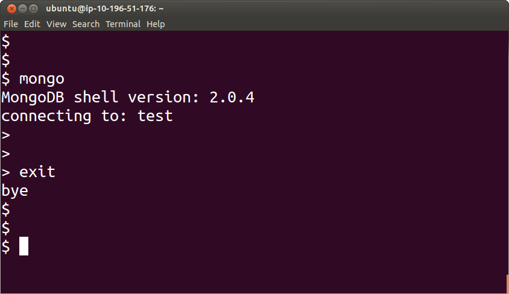
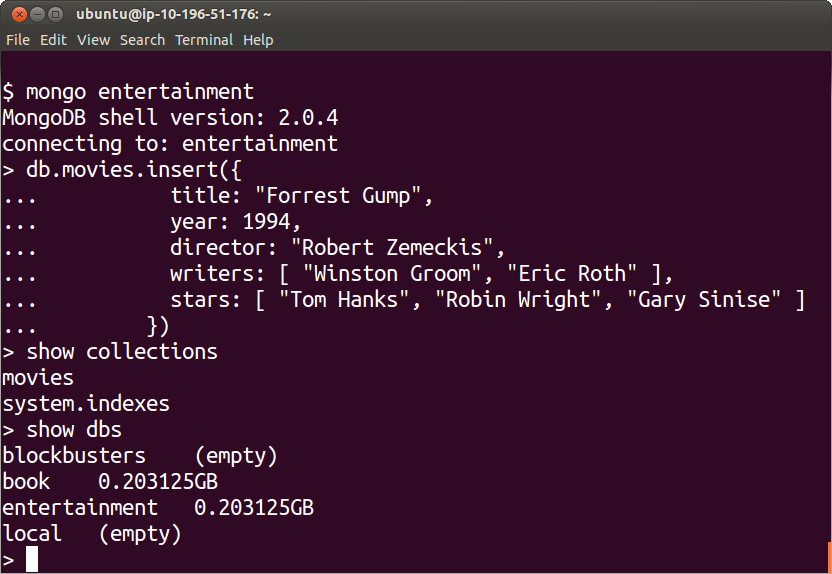

Create
======

The Shell
---------

`MongoDB`_ provides a `command shell`_ that allows you to interact directly with the databases.

You can invoke this shell by simply typing

::

   mongo

You will see something similar to

To exit from this shell simply type

::

   exit

You may also find useful to try the `help`_ command:

::

   help

from inside the mongo shell.

A Database
----------

Notice that when you start the shell, it connects by default to a "test" database.

We can instead, provide a name of a new `database`_ as an argument to the mongo
`command shell`_.

The following command will create a database called "entertainment"

::

  mongo entertainment

A Collection
------------

Inside this `database`_ we can create a new `collection`_ by simply inserting one first document into it.

Remember that the concept of a `collection`_ is alike to the concept of a table in a relational database.

The name of the `collection`_ is provided following the string "db.", in this case, to refer to a `collection`_ called "movies" we use "db.movies".

We can insert a document by using the `insert`_ command, as in:

::

  db.movies.insert

and add to it, as an argument the content of the document:

::

  db.movies.insert(
        {
          title: "Forrest Gump",
          year: 1994,
          director: "Robert Zemeckis",
          writers: [ "Winston Groom", "Eric Roth" ],
          stars: [ "Tom Hanks", "Robin Wright", "Gary Sinise" ]
        }
        )

Notice that the argument to the `insert`_ command is a `JSON`_ document.

This `JSON`_ text will be converted to `BSON`_ for internal storage and network
transmission.

To see the collections that are available in the current database we can use the command

::

   show collections

To see the databases that are available we can use the command

::

   show dbs

to use a particular database, we take advantage of the use command

::
 
   use entertainment

.. _MongoDB: http://www.mongodb.org/
.. _JSON: http://www.json.org/
.. _BSON: http://bsonspec.org/
.. _command shell: http://www.mongodb.org/display/DOCS/mongo+-+The+Interactive+Shell
.. _help: http://www.mongodb.org/display/DOCS/Overview+-+The+MongoDB+Interactive+Shell#Overview-TheMongoDBInteractiveShell-Help
.. _insert: http://www.mongodb.org/display/DOCS/Overview+-+The+MongoDB+Interactive+Shell#Overview-TheMongoDBInteractiveShell-Inserting  
.. _database: http://www.mongodb.org/display/DOCS/Databases
.. _collection: http://www.mongodb.org/display/DOCS/Collections

::

   The workshop is boooring!!! :)
