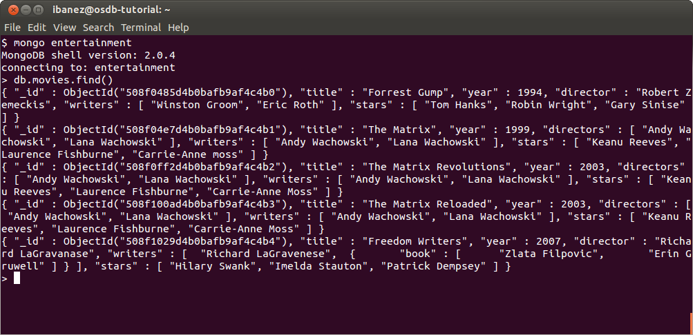
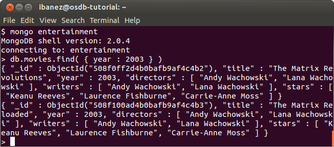
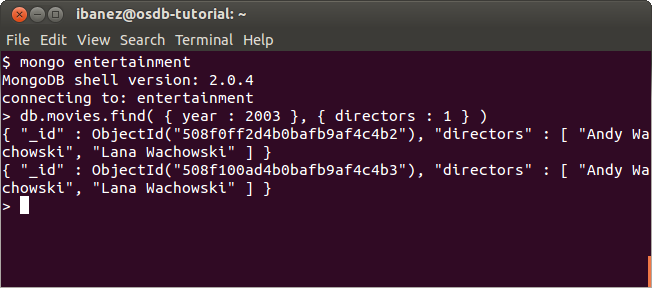
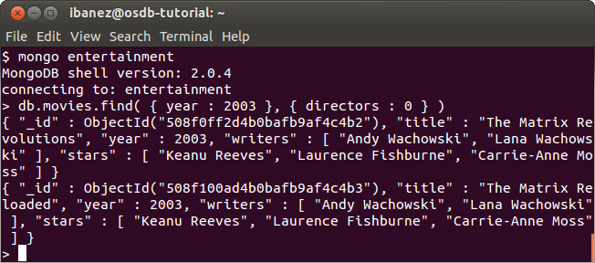
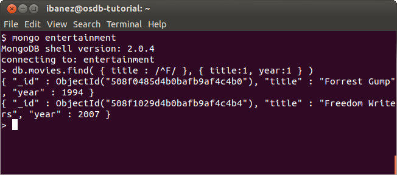

Read
====

find
----

The simplest way to retrieve data from a `MongoDB`_ collection is to use the
`find`_ command.

::

   db.movies.find()

When called without any arguments it will retrieve the entire content of the
collection (you may not want to do that in a large collection...)

Here is how it would look like in our "movies" collection

We can make the `find`_ command to be more selective by providing constrains on
the fields of the documents that we want to retrieve.

Those constrains are expressed also using a `JSON`_ format.

For example, we can set a condition on the year:

::

  db.movies.find( { year : 2003 } )

This will return results similar to

_id
---

Notice that the returned records have all an extra field `field _id`_ that we did not
provided during the update. This field is generated automatically by
`MongoDB`_, unless we provide a unique _id value at the moment of inserting the
new document.

Every document must have a unique _id field as its first attribute.

This field can not be changed once the document has been created.

More Finds
----------

* The first argument of the `find`_ command define the constrains that filter for a specific set of entries.
* The second argument can be used to specify what subset of the fields in the document must be retrieved.

For example, the following command will only show the directors of movies
produced in the year 2003.

::

   db.movies.find( { year : 2003 }, { directors : 1 } )

the output would look like:

While the following command retrieves all fields *except* the "directors"

::

   db.movies.find( { year : 2003 }, { directors : 0 } )

the output would look like:

More interesting queries can be made by taking advantage of operators.

For example we can find all the movies whose title start with "F" and retrieve their title and year:

::

   db.movies.find( { title : /^F/ }, { title : 1, year : 1 } )

The string "/^F/" represents a `regular expression`_.

* The "^" symbol stands for the beginning of the string.
* Therefore "^F" means: *any string starting with the letter F*.
 
Such query will return something similar to:

.. _MongoDB: http://www.mongodb.org/
.. _JSON: http://www.json.org/
.. _command shell: http://www.mongodb.org/display/DOCS/mongo+-+The+Interactive+Shell
.. _find: http://www.mongodb.org/display/DOCS/Advanced+Queries#AdvancedQueries-Intro
.. _field _id: http://www.mongodb.org/display/DOCS/Object+IDs#ObjectIDs-The\idField
.. _regular expression: http://www.mongodb.org/display/DOCS/Advanced+Queries#AdvancedQueries-RegularExpressions

