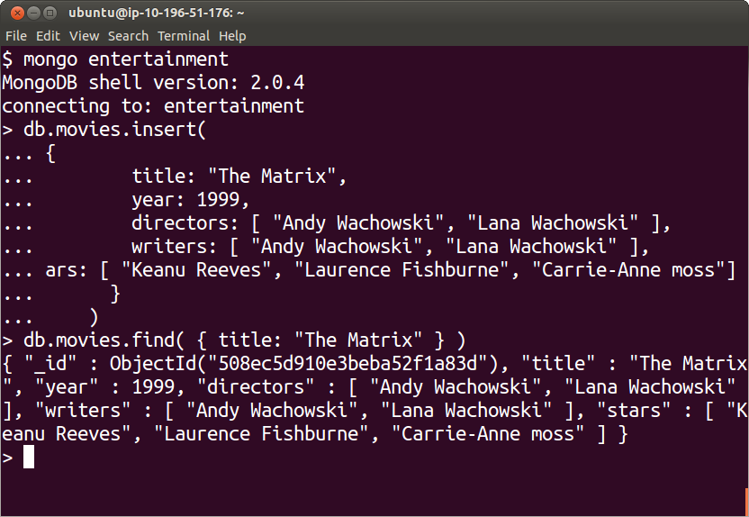
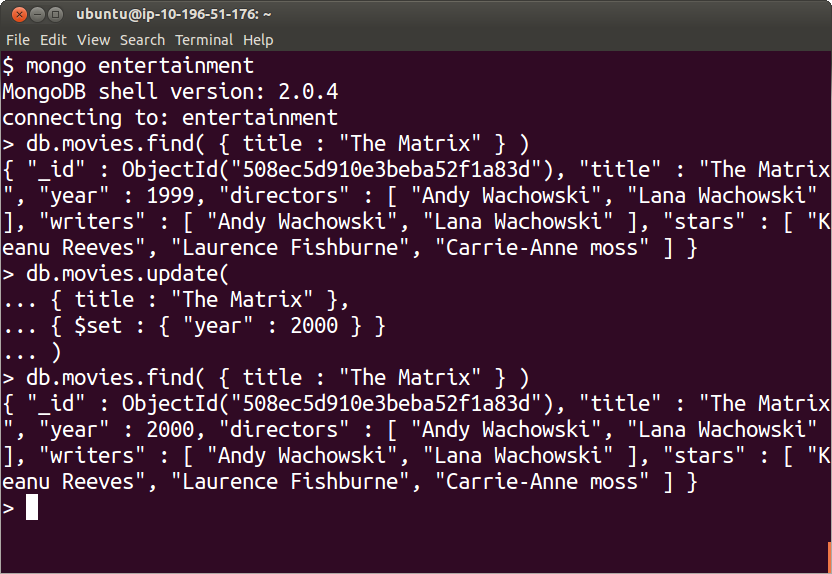

Update
======

Insert
------

Inserting new documents into a `collection`_ is done with the `insert`_ command.

This can be done from the mongo `command shell`_.

The following command inserts a new entry in our "movies" `collection`_ in the
"entertainment" `database`_.

::

  mongo entertainment

::

  db.movies.insert(
        {
          title: "The Matrix",
          year: 1999,
          directors: [ "Andy Wachowski", "Lana Wachowski" ],
          writers: [ "Andy Wachowski", "Lana Wachowski" ],
          stars: [ "Keanu Reeves", "Laurence Fishburne", "Carrie-Anne moss"] 
        }
      )

To see the effect of the insertion we can query the new entry by using the
`find`_ command:

::

  db.movies.find( { title: "The Matrix" } )

You will see something similar to the following screen:




Update
------

Modification to existing documents can be made with the `update`_ command.

The `update`_ command has two parts:

* The first one selects the documents to be modified, similar to the `find`_ command.
* The second indicates the fields that will be modified along their new values.

For example

::

  db.movies.update(
       { title: "The Matrix" },
       { $set : { "year": 2000 } }
    )

Here we are selecting the documents corresponding to movies whose title matches "The Matrix", and then we are replacing their "year" field with the value "2000".

Notice the use of the `$set`_ operator in the second part of the `update`_
command.

This operator specifies how the field is to be modified in this update.

To see the effect of the change we use again the `find`_ command:

::

  db.movies.find( { title: "The Matrix" } )




Notice how the value of the "year" field has changed after we use the `update`_
command.

Exercise
````````

* Go to the Movie Database `IMDB`_
* Find three of your favorite movies
* Insert them as documents in the movies collection using the `insert`_ command.* Review them with the `find`_ command.
* Correct any errors with the `update`_ command.

As you do, you may find that there are duplicates in the database, since some
of your peers may have selected the same movies as their favorites and during
the process of insertion MongoDB considers each one of them to be an
independent document.

Command Line
------------

In addition to creating entries from the interactive MongoDB interpreter shell,
we can also use Javascript files as the mechanism for entering data in a mongo
database.

Let write the following in a file called  "insertOneMovie.js":

::

        db.movies.insert(
        {
          title: "The Matrix",
          year: 1999,
          directors: [ "Andy Wachowski", "Lana Wachowski" ],
          writers: [ "Andy Wachowski", "Lana Wachowski" ],
          stars: [ "Keanu Reeves", "Laurence Fishburne", "Carrie-Anne Moss"] 
        }
        )

Then, we can perform the actual entry insertion with the following command

::

     mongo  entertainment  ./insertOneMovie.js


Where the first argument "entertainment" is the name of our database.


If we are working in a remote machine, we could write the script locally using
our favorite text editor, and then we can copy our insertOneMovie.js file, to
the server by using the command:

::

     scp  insertOneMovie.js  username@hostname

Where:

* "username" should be your actual username in that server
* "hostname" should be your actual name of that server

Finally, we can then use the command in the server:

::

     mongo  entertainment  ./insertOneMovie.js


Exercise
````````

Use this mechanism to enter two more of your favorite movies from the `IMDB`_
database.

More Examples
-------------


Here are a few more examples

`The Matrix Reloaded`_

::

        {
          title: "The Matrix Reloaded",
          year: 2003,
          directors: [ "Andy Wachowski", "Lana Wachowski" ],
          writers: [ "Andy Wachowski", "Lana Wachowski" ],
          stars: [ "Keanu Reeves", "Laurence Fishburne", "Carrie-Anne Moss"] 
        }

`The Matrix Revolutions`_

::

        {
          title: "The Matrix Revolutions",
          year: 2003,
          directors: [ "Andy Wachowski", "Lana Wachowski" ],
          writers: [ "Andy Wachowski", "Lana Wachowski" ],
          stars: [ "Keanu Reeves", "Laurence Fishburne", "Carrie-Anne Moss"] 
        }

`Freedom Writers`_

::

        {
          title: "Freedom Writers",
          year: 2007,
          director: "Richard LaGravanase",
          writers: [ "Richard LaGravenese", { book : [ "Zlata Filpovic", "Erin Gruwell" ] } ],
          stars: [ "Hilary Swank", "Imelda Stauton", "Patrick Dempsey" ]
        }

You will find more examples in the following directory:

https://github.com/luisibanez/open-source-databases-tutorial/tree/master/source/MongoDB/JSON


.. _MongoDB: http://www.mongodb.org/
.. _JSON: http://www.json.org/
.. _command shell: http://www.mongodb.org/display/DOCS/mongo+-+The+Interactive+Shell
.. _insert: http://www.mongodb.org/display/DOCS/Overview+-+The+MongoDB+Interactive+Shell#Overview-TheMongoDBInteractiveShell-Inserting  
.. _database: http://www.mongodb.org/display/DOCS/Databases
.. _collection: http://www.mongodb.org/display/DOCS/Collections
.. _find: http://www.mongodb.org/display/DOCS/Advanced+Queries#AdvancedQueries-Intro
.. _update: http://www.mongodb.org/display/DOCS/Updating#Updating-update%28%29
.. _$set: http://www.mongodb.org/display/DOCS/Updating#Updating-%24set
.. _IMDB: http://www.imdb.com/
.. _The Matrix Reloaded: http://www.imdb.com/title/tt0234215/
.. _The Matrix Revolutions: http://www.imdb.com/title/tt0242653/
.. _Freedom Writers: http://www.imdb.com/title/tt0463998/
