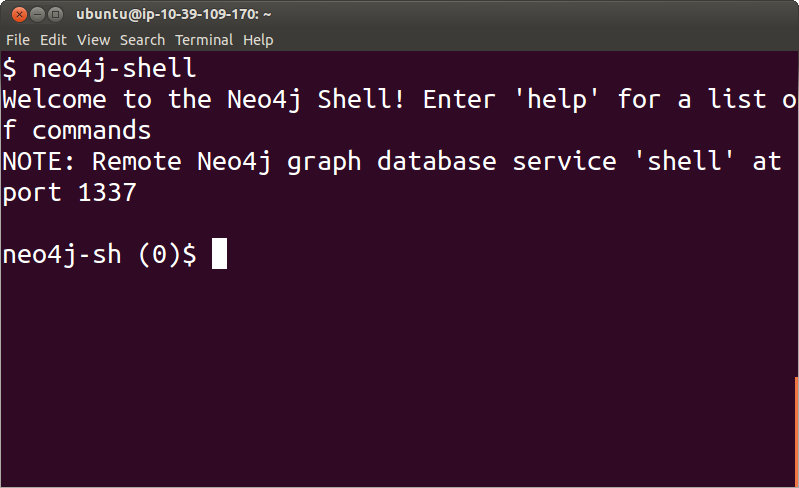
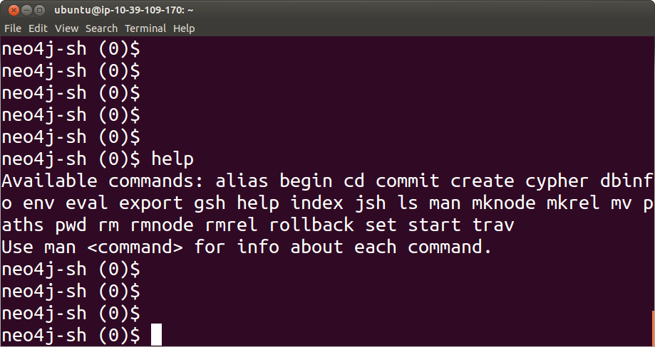

Create
======

The Shell
---------

`Neo4j`_ provides a `command shell`_ that allows you to interact directly with the databases.

You can invoke this shell by simply typing

::

   neo4j-shell

You will see something similar to

To exit from this shell simply type

::

   exit

You may also find useful to try the help command:

::

   help

from inside the `Neo4j`_ shell.

.. _command shell: http://docs.neo4j.org/chunked/stable/shell.html
.. _Neo4j: http://neo4j.org/
