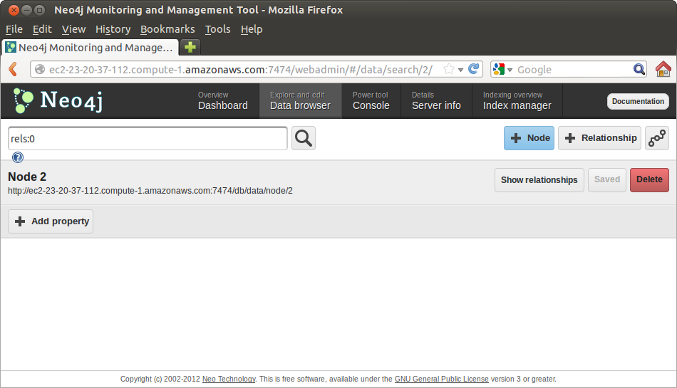
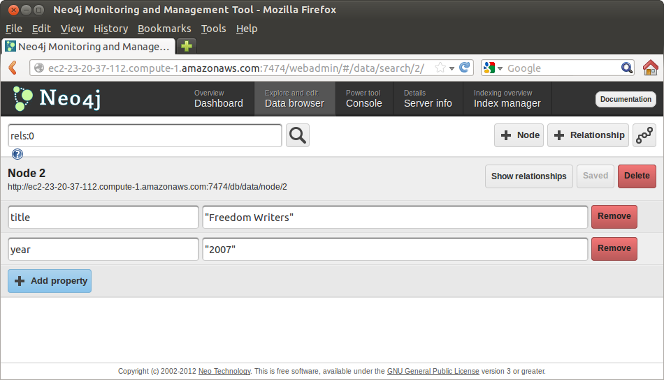
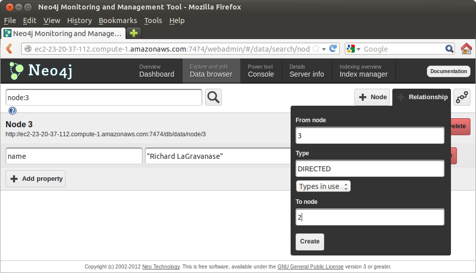
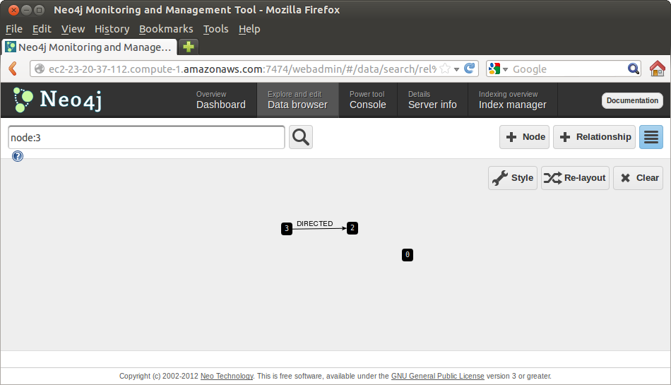
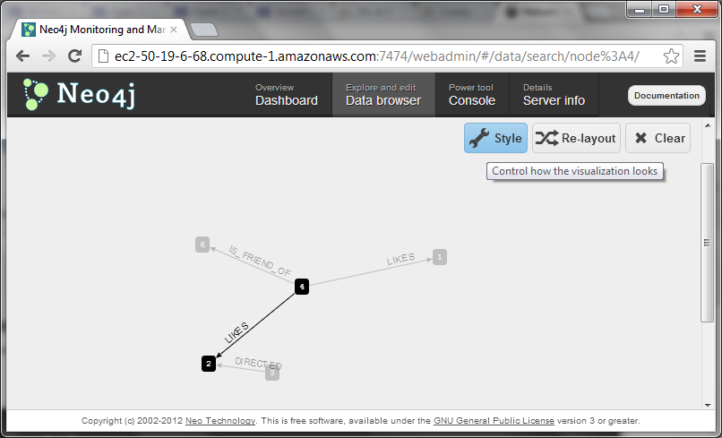
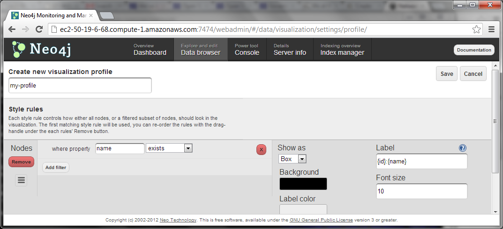
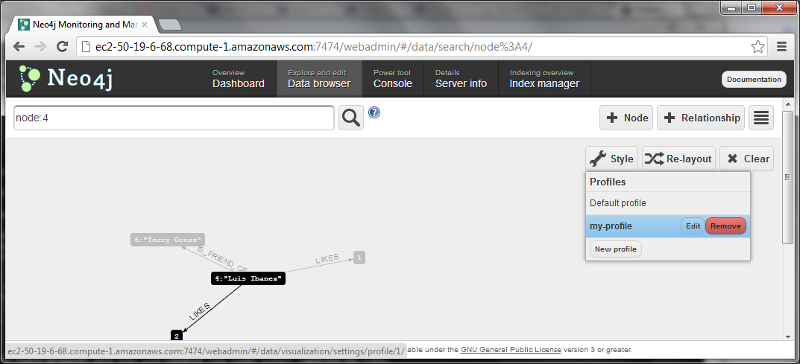
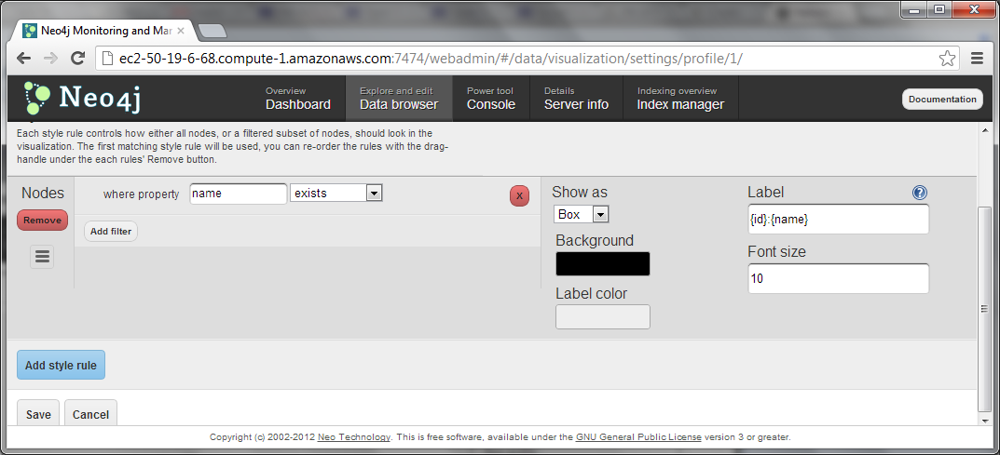
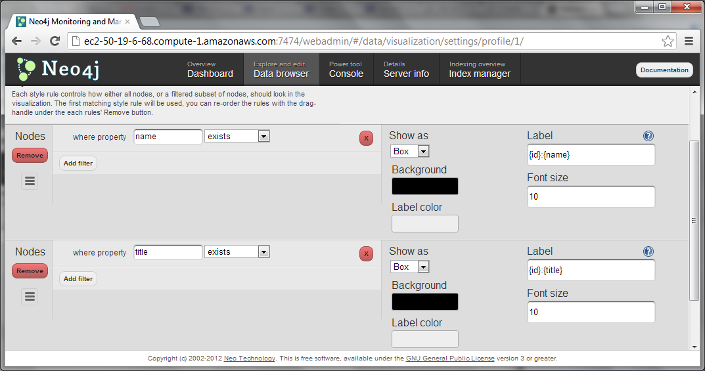
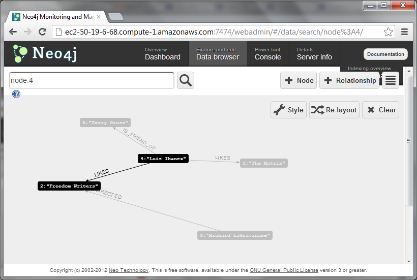

Create
======

The Shell
---------

`Neo4j`_ provides a `command shell`_ that allows you to interact directly with the databases.

You can invoke this shell by simply typing

::

   neo4j-shell

You will see something similar to

.. image:: ../../images/Neo4jCommandShell01.png
   :scale: 75 %

To exit from this shell simply type

::

   exit

You may also find useful to try the help command:

::

   help

from inside the `Neo4j`_ shell.

.. image:: ../../images/Neo4jCommandShell02.png
   :scale: 75 %


.. _command shell: http://docs.neo4j.org/chunked/stable/shell.html
.. _Neo4j: http://neo4j.org/


REST
----

Neo4j provides a `REST`_ interface.

This means that we can send data to the Neo4j server by using HTTP messages,
and we can received data back also via HTTP messages.

To do this we can use the popular `curl`_ program.

If we are logged in the server, we can use the following command:

::

   curl  http://localhost:7474/db/data/

If we are not logged in the server, we can replace "local" host with the actual
IP number of the server.

This returns text similar to:

::

        {
          "cypher" : "http://localhost:7474/db/data/cypher",
          "relationship_index" : "http://localhost:7474/db/data/index/relationship",
          "node" : "http://localhost:7474/db/data/node",
          "relationship_types" : "http://localhost:7474/db/data/relationship/types",
          "neo4j_version" : "1.7.2",
          "batch" : "http://localhost:7474/db/data/batch",
          "extensions_info" : "http://localhost:7474/db/data/ext",
          "node_index" : "http://localhost:7474/db/data/index/node",
          "reference_node" : "http://localhost:7474/db/data/node/0",
          "extensions" : {
            "CypherPlugin" : {
              "execute_query" : "http://localhost:7474/db/data/ext/CypherPlugin/graphdb/execute_query"
            },
            "GremlinPlugin" : {
              "execute_script" : "http://localhost:7474/db/data/ext/GremlinPlugin/graphdb/execute_script"
            }
          }
        }

We can then start adding data by taking advantage of our `Movie Files in JSON`_.

To better illustrate the use of Graph databases, we are going to use only two properties for the Movies entries.

* Title
* Year

and we will create the other fields as nodes, in particular

* Directors
* Stars

will be other nodes.

Let's start by adding a Movie node:

::

   curl -i -X POST http://localhost:7474/db/data/node \
     -H "Content-Type: application/json" \
     -d '{"title":"The Matrix","year":1999}'


Exercise
````````

Proceed to add your three favorite movies this way.


WebAdmin
--------

The `WebAdmin`_ interface of `Neo4j`_ also offers a friendly interface for
creating data interactively.

Dashboard
`````````

In the `Dashboard`_ tab of the web interface you can easily track the number
of nodes and relationships that have been added to the database.

.. image:: ../../images/Neo4jWebAdminConsole01.png
   :scale: 100 %

Monitor this page as you and others add more nodes and relationships into the database.

Data Browser
````````````

The `Data Browser`_ tab allows us to enter data interactively.

We can

* Add `Nodes`_
* Add `Properties`_
* Add `Relationships`_

Click in the "+ Node" button in order to add a new Movie entry.



Then click in the "+ Property" button to add the title and year of one more of your favorite movies.



Add three more movies through this interface.

Remember that we are only using Title and Year as properties.

We will now add Directors and Actors(Starts) as additional nodes.

Click again in the "+ Node" button to create a director node, and then click in the "+ Property" add its name:

.. image:: ../../images/Neo4jDBDataConsole04.png
   :scale: 100 %

We can now add a relationship between the director node and the movie node.

Click in the "+ Relationship" button.

In this case we are adding a relationship between node "3" (a director) and node "2" (a Movie) and we call the relationship type "DIRECTED", so that we can form the sentence:

::

  "Richard LaGravanase" DIRECTED "Fredoom Writers"



If we click on the "Switch View Modes" button on the upper right of the web
interface, we can see the Graph taking shape




Graphics Style
~~~~~~~~~~~~~~

You would have noticed that the graphic display is very useful, but it uses the Node Id numbers as labels, forcing us to remember what node is what.

We can improve this graphic display by customizing the labels.

* Click in the "Style"  button on the upper right (the one with a wrench icon).



* A menu will appear
* Select "New Style" button at the bottom of that menu
* A new page will be presented, where you can customize the style
* Enter a name for your new style in the upper left text field
* Edit the first style rule

 * Click in the "Add Filter" button
 * Write in the "where property" box, the text : "name"
 * In the "Label" box on the right replace "{id}" with {id}:{name}
 * What this will do is that, in the nodes that have a "name" property, the data browser will use as labels the combination of node id and the name of the node.



* Save the style.

 * This will return you to the Data Browser and now you should see some nodes labeled by name.
 * You will notice that other nodes do still have only a number as label. These are nodes that do not have "name" as a property. Let's add a style rule for these other nodes.

* Click again in the "Style" button

 * Click on the "Edit" button of the style that we just created




* Click on the "Add Style" button on the bottom left of the page



* Click in the "Add Filter" button
* Write in the "where property" box, the text : "title"
* In the "Label" box on the right replace "{id}" with {id}:{title}
* What this will do is that, in the nodes that have a "title" property, the data browser will use as labels the combination of node id and the title of the node.



* Save the style.

 * This will return you to the Data Browser.
 * Now you should see some nodes labeled by name and some labeled by title.




* Continue customizing the style until you have a display where you clearly can tell which node is which entity.


Exercise
~~~~~~~~

* Proceed to add Actors as Nodes (using only a "Name" property

 * Add relationships between Actors an the Movies they were in.
 * Do this with the relationship type "ACTED_IN".

* Proceed to add the directors of your favorite movies

 * Add relationships to the movies they directed.
 * Do this with the relationship type "DIRECTED".


.. _curl: http://en.wikipedia.org/wiki/CURL
.. _Movie Files in JSON: https://github.com/luisibanez/open-source-databases-tutorial/tree/master/source/MongoDB/JSON
.. _WebAdmin: http://docs.neo4j.org/chunked/stable/tools-webadmin.html

.. _Nodes: http://docs.neo4j.org/chunked/stable/graphdb-neo4j-nodes.html
.. _Relationships: http://docs.neo4j.org/chunked/stable/graphdb-neo4j-relationships.html
.. _Properties: http://docs.neo4j.org/chunked/stable/graphdb-neo4j-properties.html
.. _Dashboard: http://docs.neo4j.org/chunked/stable/webadmin-dashboard.html
.. _Data Browser: http://docs.neo4j.org/chunked/stable/webadmin-data.html
.. _REST: http://docs.neo4j.org/chunked/milestone/rest-api.html
