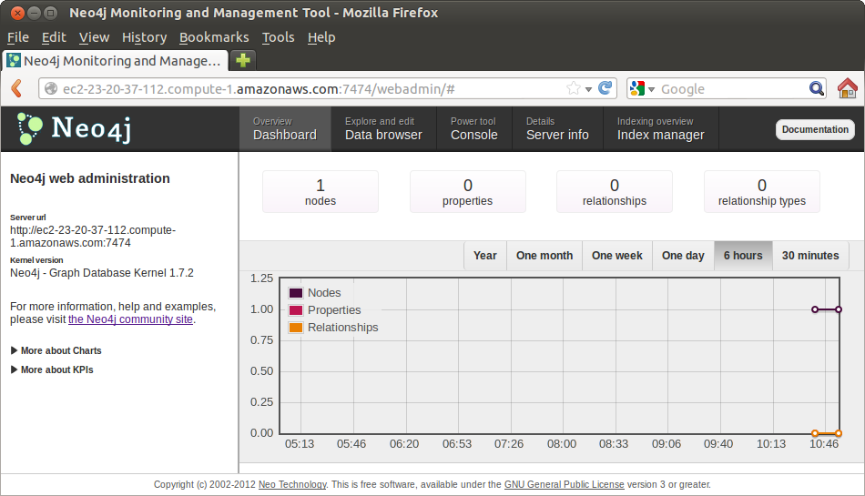
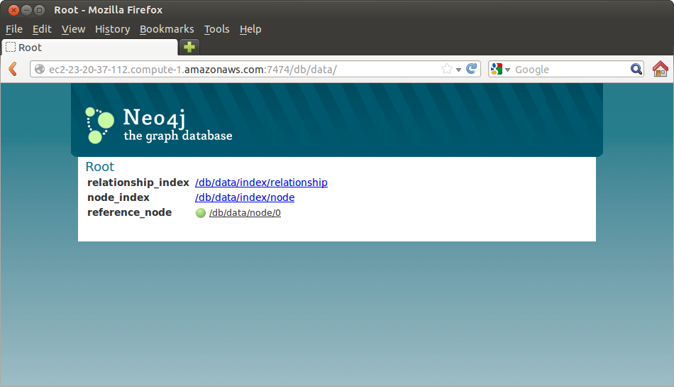

How To Install
==============

Linux
-----

Debian Package
~~~~~~~~~~~~~~

Experimental packages are available for Debian.

Instructions can be found at

       http://debian.neo4j.org/


Do the following steps

* Add a new file to the apt-get sources by doing

::

  sudo vim /etc/apt/sources.list.d/neo4j.list:

* Put this file the following line

::

  deb http://debian.neo4j.org/repo stable/

* Update the list of sources by doing

::

  sudo apt-get update

* Install the Neo4j Debian package with

::

  sudo apt-get install neo4j

* You may get a warning about not being able to authenticate the package. 

 * It will be OK to ignore the warning
 * at least for the purpose of playing with this tutorial.

At this point you should have Neo4j installed.

You can test it by invoking the Neo4j command shell

::

    neo4j-shell


Direct Download
~~~~~~~~~~~~~~~

An alternative to the Debian package installation is to do a direct `download`_ from

::

    http://neo4j.org/download/

In this case, for example, we are getting version 1.7.2 of the *Community* edition.

::

    neo4j-community-1.7.2-unix.tar.gz

Then untar the file with the command

::

    tar xzvf neo4j-community-1.7.2-unix.tar.gz

This will result in a directory named "neo4j-community-1.7.2" in your local directory.

Move this directory to "/usr/local" with the command

::

  sudo mv ./neo4j-community-1.7.2 /usr/local

Service
```````

To install the Linux service proceed with

::

  cd /usr/local/neo4j-community-1.7.2/

and launch the installation with

::

  sudo ./bin/neo4j install

it will ask you:

::

  Graph-like power should be handled carefully. What user should run Neo4j? [neo4j]

and here we accept the default username "neo4j" by simply hitting enter.

To see if the neo4j service is running, we use the command:

::

   service neo4j-service status

and initially it will return

::

   Neo4j Server is not running

Then we start the service with the command

::
 
   sudo service neo4j-service start

Notice that we use "sudo" for this command.


To allow for connections from any IP address to your server, edit the file

::

  sudo vim ./conf/neo4j-server.properties

and uncomment the line

::

  org.neo4j.server.webserver.address=0.0.0.0

Be aware that this is an unsafe way to open the server, and we are doing here
only for the purpose of playing with the database for the tutorial.
  

Web Interface
~~~~~~~~~~~~~

Neo4j includes a well-crafted web interface.

In order to make it accessible, we must open the port 7474 in the server.

This is done with the command:

::

   sudo iptables -A INPUT -p tcp --dport 7474 -j ACCEPT

and the effect can be verified with 

::

   ss -lpn

and with

::

   netstat -anp | grep 7474

If you are running your server in an Amazon EC2 instance, you have to also open
this port by creating a `Security Group`_ in the EC2 Console, or by modifying
your current `Security Group`_ to also open the port 7474 with the rule

::

   TCP Port         Source
   7474             0.0.0.0/0


With this, you can now connect to the web administration tool using

::

   firefox  http://192.168.200.148:7474/webadmin

This will display a page similar to:




and

::

   firefox  http://192.168.200.148:7474/db/data

This will display a page similar to:




.. _download: http://neo4j.org/download/
.. _Security Group: http://cloud-computing.learningtree.com/2010/09/24/understanding-amazon-ec2-security-groups-and-firewalls/
