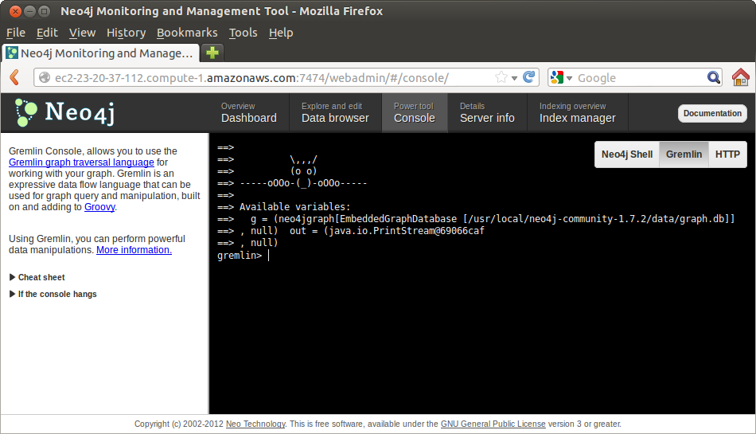
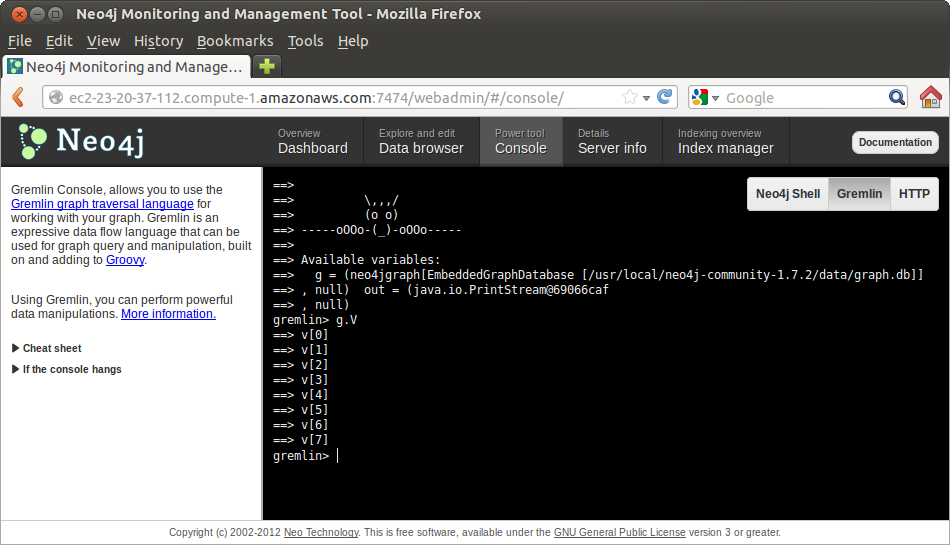
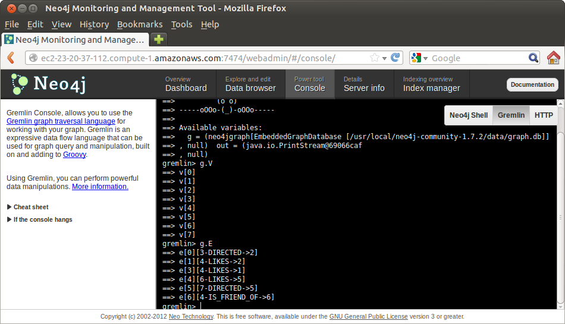

Read
====

REST
----

We can use the `REST`_ interface to perform simple queries

For example, by using `curl`_.

Nodes
`````
We can query information from nodes by doing:

::

   curl http://localhost:7474/db/data/node/1

We get back all the information about "Node 1"

::

        {
          "outgoing_relationships" : "http://localhost:7474/db/data/node/1/relationships/out",
          "data" : {
            "title" : "The Matrix",
            "year" : 1999
          },
          "traverse" : "http://localhost:7474/db/data/node/1/traverse/{returnType}",
          "all_typed_relationships" : "http://localhost:7474/db/data/node/1/relationships/all/{-list|&|types}",
          "property" : "http://localhost:7474/db/data/node/1/properties/{key}",
          "self" : "http://localhost:7474/db/data/node/1",
          "properties" : "http://localhost:7474/db/data/node/1/properties",
          "outgoing_typed_relationships" : "http://localhost:7474/db/data/node/1/relationships/out/{-list|&|types}",
          "incoming_relationships" : "http://localhost:7474/db/data/node/1/relationships/in",
          "extensions" : {
          },
          "create_relationship" : "http://localhost:7474/db/data/node/1/relationships",
          "paged_traverse" : "http://localhost:7474/db/data/node/1/paged/traverse/{returnType}{?pageSize,leaseTime}",
          "all_relationships" : "http://localhost:7474/db/data/node/1/relationships/all",
          "incoming_typed_relationships" : "http://localhost:7474/db/data/node/1/relationships/in/{-list|&|types}"
        }


and by adding more details to our URL we can be more specific about our query.

For example, we can focus on the properties

::

   curl http://localhost:7474/db/data/node/1/properties

and get back

::

        {
          "title" : "The Matrix",
          "year" : 1999
        }

or even more specifically

::

   curl http://localhost:7474/db/data/node/1/properties/title

and get back

::

    "The Matrix"

or focus on the "year" part of the Properties

::

   curl http://localhost:7474/db/data/node/1/properties/year

and get back

::

    1999


Relationships
`````````````

We can query information from relationships by doing:

::

   curl http://localhost:7474/db/data/relationship/1

We get back all the information about "Node 1"

::

        {
          "start" : "http://localhost:7474/db/data/node/4",
          "data" : {
          },
          "self" : "http://localhost:7474/db/data/relationship/1",
          "property" : "http://localhost:7474/db/data/relationship/1/properties/{key}",
          "properties" : "http://localhost:7474/db/data/relationship/1/properties",
          "type" : "LIKES",
          "extensions" : {
          },
          "end" : "http://localhost:7474/db/data/node/2"
        }

Paths
`````
Things become more interesting when we explore how two nodes might be connected.

This can be done by looking for Paths between two nodes.

Using `curl`_ we can explore the Paths from "Node 1" to "Node 4"

::

   curl  -X POST http://localhost:7474/db/data/node/1/paths \
     -H "Content-type: application/json" \
     -d '{"to":"http://localhost:7474/db/data/node/4","algorithm":"shortestPath","max_depth":10}'


In our case this returns a simple direct relationship

::

        [ {
          "start" : "http://localhost:7474/db/data/node/1",
          "nodes" : [ "http://localhost:7474/db/data/node/1", "http://localhost:7474/db/data/node/4" ],
          "length" : 1,
          "relationships" : [ "http://localhost:7474/db/data/relationship/3" ],
          "end" : "http://localhost:7474/db/data/node/4"
        } ]

But, when we look for Paths from "Node 1" to "Node 5" 

::

   curl  -X POST http://localhost:7474/db/data/node/1/paths \
     -H "Content-type: application/json" \
     -d '{"to":"http://localhost:7474/db/data/node/5","algorithm":"shortestPath","max_depth":10}'

we get a more interesting sequence

::

        [ {
          "start" : "http://localhost:7474/db/data/node/1",
          "nodes" : [ "http://localhost:7474/db/data/node/1", "http://localhost:7474/db/data/node/4", "http://localhost:7474/db/data/node/6", "http://localhost:7474/db/data/node/5" ],
          "length" : 3,
          "relationships" : [ "http://localhost:7474/db/data/relationship/3", "http://localhost:7474/db/data/relationship/6", "http://localhost:7474/db/data/relationship/4" ],
          "end" : "http://localhost:7474/db/data/node/5"
        } ]

Here we go through three relationships.

This is easier to visualize if we look back at our `Data Browser`_ page


.. image:: ../../images/Neo4jDBDataConsole09.png
   :scale: 100 %

Exercise
````````

* Find Paths between two of your friends
* Find Paths between the favorite movie of one of your friends and the favorite movie of another friend. Did you find any surprises ?
* Find Paths between two directors

Gremlin
-------

`Gremlin`_ is a Graph language hosted in `Groovy`_.

`Groovy`_ is a language created as a superset of Java.

`Gremlin`_ is a common interface for Graph databases, and in particular, it is offered through the `WebAdmin`_ interface of `Neo4j`_.

To reach the `Gremlin`_ console

* Go to the `WebAdmin`_ page
* Select the tab "Power tool Console"
* In the right button menu, select "Gremlin"



Gremlin uses slightly different terms than Neo4j to describe a graph

+-----------------+--------------------------+
| Neo4j           | Gremlin                  | 
+=================+==========================+
| Node            | Vertex                   |
+-----------------+--------------------------+
| Relationship    | Edge                     |
+-----------------+--------------------------+

Graph
`````

Gremlin refers to the Graph by using the variable "g".

We can list the Vertices (Nodes) of the Graph by using

::

   g.V

and get in our case



We can list the Edges (Relationships) of the Graph by using

::

   g.E

and get in our case



To see the Properties of a particular Vertex we can use the "map()" method in
the subscripted Vertex.

In our case, using "v" lowercase:

::

    g.v(3).map()

returns

::

    ==> {name=Richard LaGravanase}

Filters
```````
We can also use Filters in order to select subsets of the Vertices.

The command

::

  g.V.filter{it.name=='Terry Gross'}

returns in our case

::

   ==> v[6]

and we can verify the rest of Properties by doing

::

  g.v(6).map()

that returns

::

   ==> name=Terry Gross
   ==> gender=Female

We can see the outgoing Edges (Relationships) of a Vertex (Node) by using the function "outE()".

::

  g.v(6).outE()

that returns in our case

::

  ==> e[4][6-LIKES->5]


and we can see the incoming Edges (Relationships) by using the function "inE()"

::

  g.v(6).inE()

that returns in our case

::

  ==> e[6][4-IS_FRIEND_OF->6]

or we can get both with the function "bothE()"

::

  ==> e[6][4-IS_FRIEND_OF->6]
  ==> e[4][6-LIKES->5]

These same functions can be invoked in the filter itself as

::

  g.V.filter{it.name=='Terry Gross'}.inE()
  g.V.filter{it.name=='Terry Gross'}.outE()
  g.V.filter{it.name=='Terry Gross'}.bothE()

The parenthesis "()" in Gremlin functions are optional.

We could call equally

::

  g.V.filter{it.name=='Terry Gross'}.inE
  g.V.filter{it.name=='Terry Gross'}.outE
  g.V.filter{it.name=='Terry Gross'}.bothE

However, if we add an argument to the functions, we can create implicit filters.

For example

::

  g.V.filter{it.name=='Terry Gross'}.outE('LIKES')

will return the list of all the *Relationship* of type "LIKES" that are
departing from "Terry Gross" Vertex.

Therefore:

::

  g.V.filter{it.name=='Terry Gross'}.outE('LIKES').inV

will be the list of all the Vertices that "Terry Gross" likes.


Exercise
~~~~~~~~

* Find all the Relationships defined by edges incoming in one of your favorite movies.

Functions
`````````
The following are the most common functions used to navigate the Graph

From a Vertex
~~~~~~~~~~~~~

* inE = List of incoming Edges
* outE = List of outgoing Edges

From an Edge
~~~~~~~~~~~~

* inV = The Vertex to which this Edge arrive.
* outV = The Vertex from which this Edge depart.


Concatenation
`````````````

Expressions can continue to be concatenated.

In this way we can express more complex and interesting queries.

For example

::

  g.V.filter{it.name=='Terry Gross'}.outE('LIKES')

show us all the Relationships of type "LIKES" outgoing from Terry Gross.

We can be more specific and look at the Vertices to which this relationships point.

::

  g.V.filter{it.name=='Terry Gross'}.outE('LIKES').inV

and now we can add one step more to see the titles of all the movies that Terry Gross likes:

::

  g.V.filter{it.name=='Terry Gross'}.outE('LIKES').inV.title
   
To see the list of outgoing relationships of frienship we could do

::

  g.V.filter{it.name=='Terry Gross'}.outE('IS_FRIEND_OF')

and to see the names of all the friends

::

  g.V.filter{it.name=='Terry Gross'}.outE('IS_FRIEND_OF').inV.name


Exercises
~~~~~~~~~

* Do a query for the names of all your friends
* Do a query for the names of all the friends of your friends
* Do a query for the titles of the movies that your friends like
* Find the names of all the people who like your favorite movie
* Find the Directors of movies that your friends like
* For your favorite movie find: *People who likes this movie, also like these other movies...*


.. _WebAdmin: http://docs.neo4j.org/chunked/stable/tools-webadmin.html
.. _Dashboard: http://docs.neo4j.org/chunked/stable/webadmin-dashboard.html
.. _Data Browser: http://docs.neo4j.org/chunked/stable/webadmin-data.html
.. _curl: http://en.wikipedia.org/wiki/CURL
.. _REST: http://docs.neo4j.org/chunked/milestone/rest-api.html
.. _JSON: http://www.json.org/
.. _Gremlin: http://en.wikipedia.org/wiki/Gremlin_%28programming_language%29
.. _Groovy: http://en.wikipedia.org/wiki/Groovy_%28programming_language%29
.. _Neo4j: http://neo4j.org/

