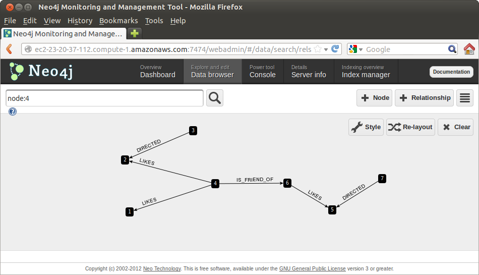

Read
====

REST
----

We can use the `REST`_ interface to perform simple queries

For example, by using `curl`_.

Nodes
`````
We can query information from nodes by doing:

::

   curl http://localhost:7474/db/data/node/1

We get back all the information about "Node 1"

::

        {
          "outgoing_relationships" : "http://localhost:7474/db/data/node/1/relationships/out",
          "data" : {
            "title" : "The Matrix",
            "year" : 1999
          },
          "traverse" : "http://localhost:7474/db/data/node/1/traverse/{returnType}",
          "all_typed_relationships" : "http://localhost:7474/db/data/node/1/relationships/all/{-list|&|types}",
          "property" : "http://localhost:7474/db/data/node/1/properties/{key}",
          "self" : "http://localhost:7474/db/data/node/1",
          "properties" : "http://localhost:7474/db/data/node/1/properties",
          "outgoing_typed_relationships" : "http://localhost:7474/db/data/node/1/relationships/out/{-list|&|types}",
          "incoming_relationships" : "http://localhost:7474/db/data/node/1/relationships/in",
          "extensions" : {
          },
          "create_relationship" : "http://localhost:7474/db/data/node/1/relationships",
          "paged_traverse" : "http://localhost:7474/db/data/node/1/paged/traverse/{returnType}{?pageSize,leaseTime}",
          "all_relationships" : "http://localhost:7474/db/data/node/1/relationships/all",
          "incoming_typed_relationships" : "http://localhost:7474/db/data/node/1/relationships/in/{-list|&|types}"
        }


and by adding more details to our URL we can be more specific about our query.

For example, we can focus on the properties

::

   curl http://localhost:7474/db/data/node/1/properties

and get back

::

        {
          "title" : "The Matrix",
          "year" : 1999
        }

or even more specifically

::

   curl http://localhost:7474/db/data/node/1/properties/title

and get back

::

    "The Matrix"

or focus on the "year" part of the Properties

::

   curl http://localhost:7474/db/data/node/1/properties/year

and get back

::

    1999


Relationships
`````````````

We can query information from relationships by doing:

::

   curl http://localhost:7474/db/data/relationship/1

We get back all the information about "Node 1"

::

        {
          "start" : "http://localhost:7474/db/data/node/4",
          "data" : {
          },
          "self" : "http://localhost:7474/db/data/relationship/1",
          "property" : "http://localhost:7474/db/data/relationship/1/properties/{key}",
          "properties" : "http://localhost:7474/db/data/relationship/1/properties",
          "type" : "LIKES",
          "extensions" : {
          },
          "end" : "http://localhost:7474/db/data/node/2"
        }

Paths
`````
Things become more interesting when we explore how two nodes might be connected.

This can be done by looking for Paths between two nodes.

Using `curl`_ we can explore the Paths from "Node 1" to "Node 4"

::

   curl  -X POST http://localhost:7474/db/data/node/1/paths \
     -H "Content-type: application/json" \
     -d '{"to":"http://localhost:7474/db/data/node/4","algorithm":"shortestPath","max_depth":10}'


In our case this returns a simple direct relationship

::

        [ {
          "start" : "http://localhost:7474/db/data/node/1",
          "nodes" : [ "http://localhost:7474/db/data/node/1", "http://localhost:7474/db/data/node/4" ],
          "length" : 1,
          "relationships" : [ "http://localhost:7474/db/data/relationship/3" ],
          "end" : "http://localhost:7474/db/data/node/4"
        } ]

But, when we look for Paths from "Node 1" to "Node 5" 

::

   curl  -X POST http://localhost:7474/db/data/node/1/paths \
     -H "Content-type: application/json" \
     -d '{"to":"http://localhost:7474/db/data/node/5","algorithm":"shortestPath","max_depth":10}'

we get a more interesting sequence

::

        [ {
          "start" : "http://localhost:7474/db/data/node/1",
          "nodes" : [ "http://localhost:7474/db/data/node/1", "http://localhost:7474/db/data/node/4", "http://localhost:7474/db/data/node/6", "http://localhost:7474/db/data/node/5" ],
          "length" : 3,
          "relationships" : [ "http://localhost:7474/db/data/relationship/3", "http://localhost:7474/db/data/relationship/6", "http://localhost:7474/db/data/relationship/4" ],
          "end" : "http://localhost:7474/db/data/node/5"
        } ]

Here we go through three relationships.

This is easier to visualiza if we look back at our `Data Browser`_ page




Exercise
````````

* Find Paths between two of your friends
* Find Paths between the favorite movie of one of your friends and the favorite movie of another friend. Did you find any surprises ?
* Find Paths between two directors


.. _Dashboard: http://docs.neo4j.org/chunked/stable/webadmin-dashboard.html
.. _Data Browser: http://docs.neo4j.org/chunked/stable/webadmin-data.html
.. _curl: http://en.wikipedia.org/wiki/CURL
.. _REST: http://docs.neo4j.org/chunked/milestone/rest-api.html
.. _JSON: http://www.json.org/
