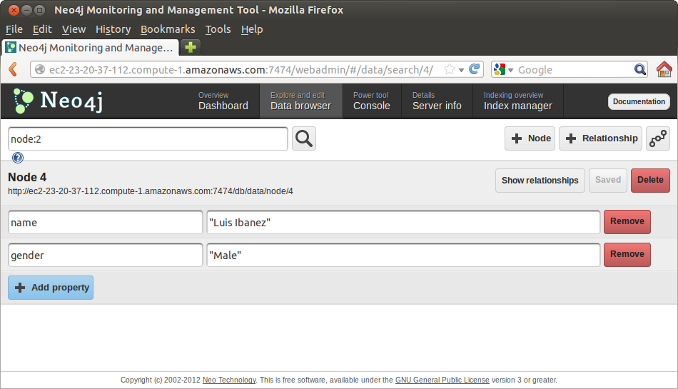
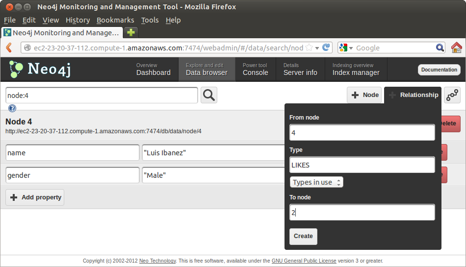

Update
======

Insert
------

Nodes
`````

Here we are going to take a step towards making our database more interesting.

We are going to add our own names, in order to create a social network, and
then include the relationships to the movies that we like and the movies that
we do not like.

From the `Data Browser`_ interface, add a node for yourself using the "+ Node" button, and then add Properties

* Name
* Gender

by using the "+ Properties" button



As you do this, from time to time check the `Dashboard`_ to see how the number
of nodes and relationships grows in the database.

Relationships
`````````````

Continue from the `Data Browser`_ to add relationships with the "+
Relationship" button. This time add the relationship between the node that
represents you, and the movies that you like. Use the type "LIKES" for this
relationships.



Add the "LIKES" relationship to all the movie nodes that you like.

If you need to check nodes, use the search field on the upper-left corner, and write text such as

::

  node:4

or

::

  relationship:1


Friends
~~~~~~~

Now add relationships of friendship to your peers.

Use the type "IS_FRIEND_OF" for these relationships.


REST
----

Note that similar insertions of data could be done from the `REST`_ interface, for example by using `curl`_.


Nodes
`````

For example, we could add a movie with

::

   curl -i -X POST http://localhost:7474/db/data/node \
     -H "Content-Type: application/json" \
     -d '{"title":"The Hunchback of Notre Dame","year":1939}'

or add a person with

::

   curl -i -X POST http://localhost:7474/db/data/node \
     -H "Content-Type: application/json" \
     -d '{"name":"Terry Gross","gender":"Female"}'

Relationships
`````````````
We can add a relationship with the command

::

   curl -i -X POST http://localhost:7474/db/data/node/6/relationships \
     -H "Content-Type: application/json" \
     -d '{"to":"http://localhost:7474/db/data/node/5","type":"LIKES"}'

Where we are assuming that "Node 6" is the one that was assigned to "Terry
Gross", and that "Node 5" is the one that got assigned to "The Hunchback of
Notre Dame" movie.


.. _Dashboard: http://docs.neo4j.org/chunked/stable/webadmin-dashboard.html
.. _Data Browser: http://docs.neo4j.org/chunked/stable/webadmin-data.html
.. _curl: http://en.wikipedia.org/wiki/CURL
.. _REST: http://docs.neo4j.org/chunked/milestone/rest-api.html
