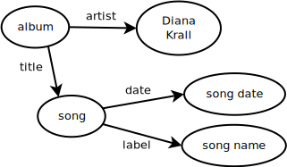

Query Lesson
=============

Pre-Requisites
--------------

This lesson expects that you read first the sections

* Overview

The hands-on activity is expected to be done in this Lesson. Therefore, as you
read the sections above, simply focus on understanding the concepts.

Resources
---------

For this lesson we will use the Web interface of `DBpedia`_.

To start, open your Web Browser at the address of the `Virtuoso SPARQL Query Editor`_

::

        http://dbpedia.org/sparql

We will also use in parallel the SNORQL Explorer

::

        http://dbpedia.org/snorql/

to see the hyperlinks of the same type of searches

Queries
-------

Query 01
~~~~~~~~

Go to the DBpedia SPARQL end point.

::

        http://dbpedia.org/sparql

and in the "Query Text" window, type:

::

  PREFIX dbo: <http://dbpedia.org/ontology/>
  PREFIX dbr: <http://dbpedia.org/resource/>

  SELECT ?album WHERE {
     ?album dbo:artist dbr:Diana_Krall .
  }

* Replace the name of "Diana Krall" with your favorite artist.

  * Note that spaces in the name are replaced with "_" underscores.
  * This follows the format of the Wikipedia URLs

Query 02
~~~~~~~~

Add a second condition to retrieve all songs from the albums of this artist

::

  PREFIX dbo: <http://dbpedia.org/ontology/>
  PREFIX dbr: <http://dbpedia.org/resource/>
  PREFIX dbp: <http://dbpedia.org/property/>

  SELECT ?song WHERE {
     ?album dbo:artist dbr:Diana_Krall .
     ?album dbp:title  ?song .
  }

Notice the addition of the prefix "dbp" pointing to the URI

::

    <http://dbpedia.org/property/>

and how the variable "?album" is used internally to relate the Graph Pattern
between the artist and the songs.

.. image:: ../../images/SPARQL_GraphPattern_01.svg
   :scale: 50 %

This figure illustrates the concept of the Graph Pattern that is being used in
this particular query. We first think about the entities {singer, album, song},
and their relationships { artist, title }, to then SELECT the information that
we want to extract from the sections of the RDF graph WHERE that Pattern is
found to match.

The ?album variable was used in the Graph Pattern to link the artist to the
song, and the node itself is not being included in the SELECT clause as part of
the values that will be returned in the result.

* Perform this query for two of your favorite artists

  * Verify that your favorite songs appear in the results

Query 03
~~~~~~~~

Note that in the previous query the results may have repeated songs, since some
songs may have been published in multiple albums.

Add the "DISTINCT" solution modified to the SELECT clause, in oder to eliminate
repeated answers.

::

  PREFIX dbo: <http://dbpedia.org/ontology/>
  PREFIX dbr: <http://dbpedia.org/resource/>
  PREFIX dbp: <http://dbpedia.org/property/>

  SELECT DISTINCT ?song WHERE {
     ?album dbo:artist dbr:Diana_Krall .
     ?album dbp:title  ?song .
  }

* Apply this to your favorite artist

  * Verify that no songs are repeated in the results.

Query 04
~~~~~~~~

Try the search now with "Bob_Dylan".

You will find that this artist have many songs.

Use the LIMIT clause to restrict the number of returned values to 15 songs

::

  PREFIX dbo: <http://dbpedia.org/ontology/>
  PREFIX dbr: <http://dbpedia.org/resource/>
  PREFIX dbp: <http://dbpedia.org/property/>

  SELECT DISTINCT ?song WHERE {
     ?album dbo:artist dbr:Bob_Dylan .
     ?album dbp:title  ?song .
  }

  LIMIT 15

* Below LIMIT, add the "OFFSET 5" clause to start the group of 15 songs in the fifth song
* Experiment with two other values of LIMIT
* Experiment with two other values of OFFSET

Query 05
~~~~~~~~

We have been connecting the artist to the songs via the albums, but we could
also query graph via the direct relationship between the songs and the artist.

Try the following query

::

  PREFIX dbo: <http://dbpedia.org/ontology/>
  PREFIX dbr: <http://dbpedia.org/resource/>

  SELECT DISTINCT ?song WHERE {
     ?song dbo:artist dbr:Diana_Krall .
  }

* Compare the results of this query with the results we obtained when using the album as part of the Graph Pattern

Query 06
~~~~~~~~

Find the dates in which these songs were released by using the following graph Pattern.

::

  PREFIX dbo: <http://dbpedia.org/ontology/>
  PREFIX dbr: <http://dbpedia.org/resource/>

  SELECT DISTINCT ?song ?songdate WHERE {
     ?song dbo:artist dbr:Diana_Krall .
     ?song dbo:releaseDate ?songdate .
  }

* Apply this to your favorite artist

Query 07
~~~~~~~~

Request the query to return the songs ordered by their release date.

To do this use the ORDER BY clause

::

  PREFIX dbo: <http://dbpedia.org/ontology/>
  PREFIX dbr: <http://dbpedia.org/resource/>

  SELECT DISTINCT ?song ?songdate WHERE {
     ?song dbo:artist dbr:Diana_Krall .
     ?song dbo:releaseDate ?songdate .
  }

  ORDER BY ?songdate

* Apply this to your favorite artist
* Sort the results by the name of the song instead of the date

Query 08
~~~~~~~~

In some cases we may know the exact label name that has been associated with an
URI. For example, the song

* "Almost Blue"

has a DBpedida resource

::

  <http://dbpedia.org/resource/Almost_Blue_(song)>

and that resource has a human friendly label

::

   "Almost Blue (song)"

that to further clarify that it is expressed in the English language, is written as

::

   "Almost Blue (song)"@en

Why is it important to include the Language specification ?

Let's consider the word "con", that in English can mean

* A convict
* The act or process of steering a vessel
* The station or post of the person who steers a vessel
* To learn or commit to memory
* To study, peruse, or examine carefully
* An argument or opinion against something
* One who holds an opposing opinion or view

While in French... well...
it is an offensive word that can bring you in to a fight.

It is therefore useful to differentiate

* "con"@en
* "con"@fr

To indicate when we are referring to the word in English or the word in French.

We can use these type of text specification to make a search that indicate the
explicit name of a resource in a given language.

::

  PREFIX dbp: <http://dbpedia.org/property/>

  SELECT DISTINCT ?album  WHERE {
      ?album  dbp:title  "Stop This World"@en .
  }

Query 09
~~~~~~~~

The Graph Patterns indicated in triplets of

* Subject
* Predicate
* Object

are terminated with a "." symbol, as in

::

   ?song dbo:artist dbr:Diana_Krall .

When two or more of such triplets have the same subject, they can be written in a more compact way using ";" as terminator.

For example

::

     ?song dbo:artist dbr:Diana_Krall .
     ?song dbo:releaseDate ?songdate .

can written as

::

     ?song dbo:artist dbr:Diana_Krall ;
           dbo:releaseDate ?songdate .

In a full query this will be

::

  PREFIX dbo: <http://dbpedia.org/ontology/>
  PREFIX dbr: <http://dbpedia.org/resource/>

  SELECT DISTINCT ?song ?songdate WHERE {
     ?song dbo:artist dbr:Diana_Krall ;
           dbo:releaseDate ?songdate .
  }

* Add more statements sharing the subject.

Query 10
~~~~~~~~

The Graph Patterns indicated in triplets of

* Subject
* Predicate
* Object

are terminated with a "." symbol, as in

::

   ?song dbo:artist dbr:Diana_Krall .

When two or more of such triplets have the same subject and predicate, they can
be written in a more compact way using "," as terminator.

For example

The expression to search for an album that has the two songs

* "Stop This World"
* "Narrow Daylight"

can be written as

::

    ?album  dbp:title  "Stop This World"@en .
    ?album  dbp:title  "Narrow Daylight"@en .

can written as

::

      ?album  dbp:title  "Stop This World"@en ,
                         "Narrow Daylight"@en

In a full query this will be

::

  PREFIX dbp: <http://dbpedia.org/property/>

  SELECT DISTINCT ?album  WHERE {
      ?album  dbp:title  "Stop This World"@en ,
                         "Narrow Daylight"@en

  }

* Find the album where two of your favorite songs are included.

Query 11
~~~~~~~~

Restrict the results to songs released after "2001"

To do this use the FILTER function

::

  PREFIX dbo: <http://dbpedia.org/ontology/>
  PREFIX dbr: <http://dbpedia.org/resource/>
  PREFIX xsd: <http://www.w3.org/2001/XMLSchema#>

  SELECT DISTINCT ?song ?songdate WHERE {
     ?song dbo:artist dbr:Diana_Krall .
     ?song dbo:releaseDate ?songdate .
     FILTER ( ?songdate > "2001"^^xsd:date )
  }

* Return only songs released after 2004
* Sort them by date
* Limit the number of results to only five songs

Query 12
~~~~~~~~

Restrict the results to songs released after "2001" and before "2009".

To do this use the FILTER function

::

  PREFIX dbo: <http://dbpedia.org/ontology/>
  PREFIX dbr: <http://dbpedia.org/resource/>
  PREFIX xsd: <http://www.w3.org/2001/XMLSchema#>

  SELECT DISTINCT ?song ?songdate WHERE {
     ?song dbo:artist dbr:Diana_Krall .
     ?song dbo:releaseDate ?songdate .
     FILTER ( ?songdate > "2001"^^xsd:date && ?songdate < "2009"^^xsd:date )
  }

* Return only songs released after 2003 and before 2005
* Sort them by date
* Limit the number of results to only five songs
* Use the name of your favorite artist

  * Experiment the range of dates to get the period of your favorite songs

Query 13
~~~~~~~~

The FILTER function can also be used to select the language of the result.

::

  PREFIX dbo: <http://dbpedia.org/ontology/>
  PREFIX dbr: <http://dbpedia.org/resource/>
  PREFIX rdfs: <http://www.w3.org/2000/01/rdf-schema#>

  SELECT DISTINCT ?song ?songdate WHERE {
     ?song dbo:artist dbr:Diana_Krall .
     ?song rdfs:label ?songname .
     FILTER ( lang(?songname) = "en" )
  }

* Search for an artist with songs in a different language.

For example, the following query returns songs from Celine Dion, with titles in
Japanesse.

::

  PREFIX dbo: <http://dbpedia.org/ontology/>
  PREFIX dbr: <http://dbpedia.org/resource/>
  PREFIX rdfs: <http://www.w3.org/2000/01/rdf-schema#>

  SELECT DISTINCT ?song ?label WHERE {
     ?song dbo:artist dbr:Celine_Dion .
     ?song rdfs:label ?label .
     FILTER (lang(?label) = "ja" )
  }

* Repeate this search for two of your favorite artists.
* Find whether they have songs in other languages.

Query 14
~~~~~~~~

When defining a Graph Pattern, sometimes it is convenient to define some of the
triplets as OPTIONAL.

The following query

::

  PREFIX dbo: <http://dbpedia.org/ontology/>
  PREFIX dbr: <http://dbpedia.org/resource/>
  PREFIX dbp: <http://dbpedia.org/property/>

  SELECT DISTINCT ?album ?this ?next WHERE {
     ?album dbo:artist dbr:Ray_Charles .
     ?album dbp:thisAlbum ?this .
     ?album dbp:nextAlbum ?next .
  }

Lists all the albums from "Ray Charles", by showing the label of the name of
the current album along with the name of the following album.

By making the "nextAlbum" triplet to be an OPTIONAL one

::

  PREFIX dbo: <http://dbpedia.org/ontology/>
  PREFIX dbr: <http://dbpedia.org/resource/>
  PREFIX dbp: <http://dbpedia.org/property/>

  SELECT DISTINCT ?album ?this ?next WHERE {
     ?album dbo:artist dbr:Ray_Charles .
     ?album dbp:thisAlbum ?this .
     OPTIONAL { ?album dbp:nextAlbum ?next . }
  }

We get result for a larger set of albums.

* Repeate this search for two of your favorite artists.

Query 15
~~~~~~~~

When using OPTIONAL triplets, we can then be more explicit about looking for results indicating connections that are not there.

For example, we can see what album did not have a next one

::

  PREFIX dbo: <http://dbpedia.org/ontology/>
  PREFIX dbr: <http://dbpedia.org/resource/>
  PREFIX dbp: <http://dbpedia.org/property/>

  SELECT DISTINCT ?album ?this ?next WHERE {
     ?album dbo:artist dbr:Ray_Charles .
     ?album dbp:thisAlbum ?this .
     OPTIONAL { ?album dbp:nextAlbum ?next . }
     FILTER( !bound( ?next ) )
  }

The function "bound()" indicates whether a variable was associated to a value
or not. This is equivalent to whether a match was found for the Graph Pattern
that included this variable. When some variables are used in OPTIONAL triplets,
they may be "unbound" which is what the expression "!bound()" tests for.

The "!" symbol is used here as a logical negation, or NOT operator.

* Repeate this search for two of your favorite artists.

Query 16
~~~~~~~~

A more explict way of searching for non existing triplets is to use the "NOT EXISTS" test.

The previous query could then we expressed as

::

  PREFIX dbo: <http://dbpedia.org/ontology/>
  PREFIX dbr: <http://dbpedia.org/resource/>
  PREFIX dbp: <http://dbpedia.org/property/>

  SELECT DISTINCT ?album ?this ?next WHERE {
     ?album dbo:artist dbr:Ray_Charles .
     ?album dbp:thisAlbum ?this .
     FILTER NOT EXISTS { ?album dbp:nextAlbum ?next . }
  }

* Repeate this search for two of your favorite artists.

Query 17
~~~~~~~~

An equivalent expression to "NOT EXISTS" is the "MINUS" expression.

The previous query could then we expressed as

::

  PREFIX dbo: <http://dbpedia.org/ontology/>
  PREFIX dbr: <http://dbpedia.org/resource/>
  PREFIX dbp: <http://dbpedia.org/property/>

  SELECT DISTINCT ?album ?this ?next WHERE {
     ?album dbo:artist dbr:Ray_Charles .
     ?album dbp:thisAlbum ?this .
     MINUS { ?album dbp:nextAlbum ?next . }
  }

* Repeate this search for two of your favorite artists.

Query 18
~~~~~~~~

Richer Graph Patterns can be used to make more specific queries.

::

  PREFIX dbo: <http://dbpedia.org/ontology/>
  PREFIX dbr: <http://dbpedia.org/resource/>
  PREFIX dbp: <http://dbpedia.org/property/>
  PREFIX rdfs: <http://www.w3.org/2000/01/rdf-schema#>

  SELECT DISTINCT ?album ?song ?songname ?songdate WHERE {
     ?album dbo:artist dbr:Diana_Krall .
     ?album dbp:title ?song .
     ?song  rdfs:label ?songname .
     ?song  dbp:date   ?songdate .
  }

Note that the variable "?song" is used as object in one triplet, and as subject
in two following triplets. This larger pattern carries a larger amount of
information as input to the query, and also makes possible to return additional
information in the result.

We could simplify the expressions by taking advantage of the ";" notation

::

  PREFIX dbo: <http://dbpedia.org/ontology/>
  PREFIX dbr: <http://dbpedia.org/resource/>
  PREFIX dbp: <http://dbpedia.org/property/>
  PREFIX rdfs: <http://www.w3.org/2000/01/rdf-schema#>

  SELECT DISTINCT ?album ?song ?songname ?songdate WHERE {
     ?album dbo:artist dbr:Diana_Krall ;
            dbp:title ?song .
     ?song  rdfs:label ?songname ;
            dbp:date   ?songdate .
  }

.. _Virtuoso SPARQL Query Editor: http://dbpedia.org/sparql
